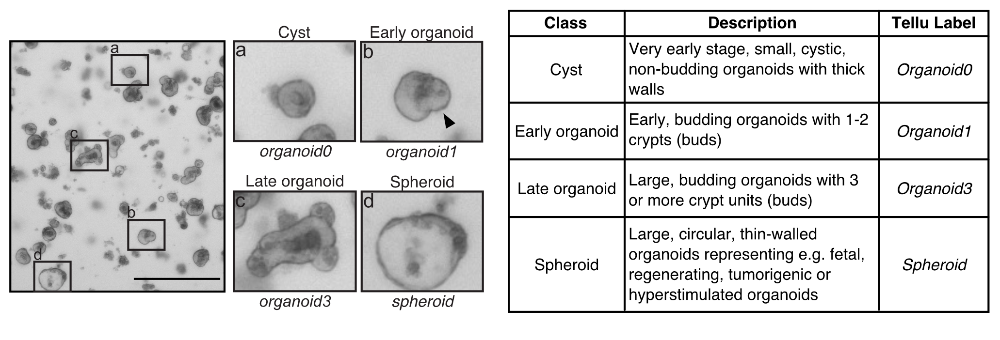
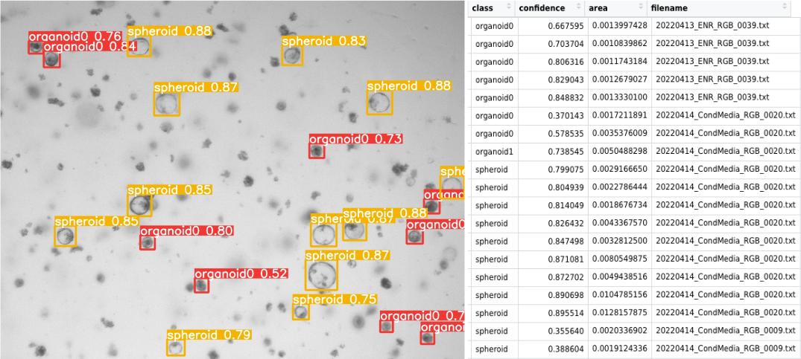

# Tellu - Intestinal Organoid Classifier

<p align="center">


</p>
<br>


# Documentation

Tellu is a deep convolutional network (Yolov5) trained to classify mouse intestinal organoids from light-transmitted images into 4 classes based on morphology: 

<p align="center">

</p>

Tellu works best with images taken from the EVOS FL microscope or Nikon Eclipse Ti-E (3) Primo3 microscope at 4X. 

Tellu outputs a folder with all the detections drawn in the images and also a text file where each row is a detected organoid, the class, confidence of the prediction and relative area of the bounding box (arbitrary units).

<p align="center">

</p>

There are two ways to use Tellu: You can run Tellu using the Google Colaboratory environment or locally on your computer.

## 1. Google Collab (No coding experience needed)

The easiest way to use Tellu for inference of your data is through Google Colab [](https://colab.research.google.com/drive/1j-jutA52LlPuB4WGBDaoAhimqXC3xguX?usp=sharing)
<br>

## 2. Nextflow pipeline (requires basic interaction with the terminal)

It can be used on any POSIX compatible system (Linux, OS X, etc)

> **Note**:
> The pipeline is written in DSL1. The latest versions of Nextflow that support it are 22.04.x and 22.10.x. We are currently updating the pipeline to DSL2. 

In case you prefer to run Tellu locally, we have created a Nextflow pipeline that runs Tellu and tidies the output detections in a single file with an extra column with the filename information. The pipeline also outputs the images with the detections drawn so you can assess how good has it been.  

### Installation

Nextflow requires Java 11 or later.

- Install docker desktop and start it if not started automatically (<https://www.docker.com/get-started/>).  
- Install Nextflow by running the following code in the terminal (macOS/Unix): (<https://www.nextflow.io/docs/latest/getstarted.html>)
  
```bash
curl -s https://get.nextflow.io | bash
```

### Run Tellu

You can run the pipeline by typing in the terminal:  

```bash
nextflow run evdomene/tellervo --ext tif --inputdir /path/to/your/images 
```

An easy way to get the path to your image folder is after typing --inputdir to drag the folder from finder to the terminal and it will write the whole path automatically.  

Note that the first time the pipeline is run, it will need to download the GitHub repository and the docker images needed to run Tellu, and therefore it will take more time than the second time you use it.  

**Parameters**

* --inputdir: folder with the images/videos to be analyzed. Avoid empty spaces in the filenames. 
* --ext: file extension of the files to be analyzed. Tellu accepts jpeg, tiff, tif, png, bmp, avi, mp4, mov, m4v, wmv, mkv.
* --outdir: folder to store results.

For help and options available you can run:  

```bash
nextflow run evdomene/tellervo --help
```

After the run, you will find a results folder with an "AllDetections.txt" file and an image folder with the images with the bounding boxes drawn.  

You can find more help about nextflow at <https://www.nextflow.io/docs/latest/getstarted.html>

# Downstream analysis

After obtaining the detection file a common downstream analysis would be to read the file in R and add the metadata with the treatment and condition information to be able to summarize the data.  

**Option 1: Metadata is in a separate file**

If the metadata information is in a separate file that has the filename of the images and the rest of the biological information you can add this information in R using left_join() from *tidyverse* package:

```r
library(tidyverse)

metadata <- read_tsv("metadata.txt")

data <- read_tsv("AllDetections.txt") %>%
  left_join(., metadata, by=c("filename")) #filename is the name of the column that has the filename information. 

#Note if the column in metadata is called different you can use by=c("filename"="nameinmetadata"))

```

**Option 2: Metadata is in the filename**

If the metadata information is in the filename (e.g Date_Treatment_Well1.txt) this information can easily be added as columns in R using the separate() function from *tidyverse*. Note that is important that the separator used between information is constant and preferentially the same pattern is consistent between filenames.  

```r
library(tidyverse)
cols = c("day", "group", "well")

data <- read_tsv("AllDetections.txt") %>%
  separate(filename, into=cols, sep="_", extra="merge") 
# extra option tells what to do if there is more info after the columns specified in cols. In this case it adds it to the last column. 
# You can set it to drop if you want to discard it. 

```

After the metadata is added to the table, a common analysis in R would be:  

```r
library(tidyverse)

quantification <- data %>% 
  group_by( day,  group, well, class) %>% #group by well and organoid class
  summarise(N = n()) %>%
  mutate (freq = N/sum(N)) %>%
  ungroup() %>%
  complete(day, group, well, class, fill=list(N=0, freq=0)) #this line fills the summary with the classes where there are 0 counts. 


# BoxPlot 
(boxplot <- quantification %>% 
  ggplot(aes(x=group, y=freq))+
    geom_boxplot()+
    geom_point()+
    facet_grid(day~class)+
    theme_minimal())

```

The AllDetections.txt file also contains the relative area for each detection. A plot comparing the relative areas would look like this:

```r
(data %>%
ggplot(aes(x=group, y=area))+
  geom_boxplot()+
  geom_point()+
  facet_grid(day~class)+
  theme_minimal())

```
